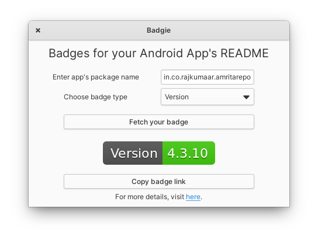

  

  <h1>Badgie</h1>
  

    Say NO to hardcoding!
     
    Generate badges for your android app's README with realtime data
     
    from Google Playstore such as Version, Number of Installs, Rating etc
  

  
  
This app is available on the elementary OS AppCenter.

  

# Install it from source

You can of course download and install this app from source.

## Dependencies

Ensure you have these dependencies installed

* granite
* gtk+-3.0
* libsoup-2.4
* gee-0.8
* gdk-pixbuf-2.0

## Install, build and run

Run `meson` build to configure the build environment. Change to the build directory and run `ninja` to build

    meson build --prefix=/usr
    cd build
    ninja

To install, use `ninja install`, then execute with `com.github.rajkumaar23.badgie`

    sudo ninja install
    com.github.rajkumaar23.badgie
